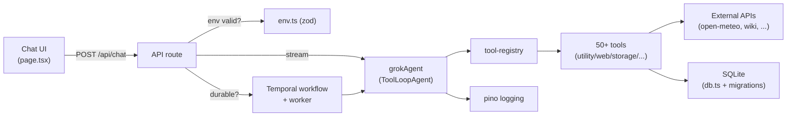

# BRUTHA

A minimal **AI agent** built with **Next.js 16 (App Router)**, the **Vercel AI SDK v6**, and **xAI's Grok**. It demonstrates the core loop of an agent framework: the model reasons, calls tools, reads the results, and loops until it has a final answer — all streamed to a chat UI.

## Features

- **Agentic tool-calling loop** via the AI SDK's `ToolLoopAgent` (model → tool → model, up to 14 steps).
- **Streaming responses** with the `useChat` hook (AI SDK v6).
- **50+ built-in tools**, organized by category in `src/lib/tools/`:

  **Math & conversions** — `calculate`, `convertUnits` (length/mass/temp/volume), `convertCurrency` (live ECB rates), `convertTimeZone`, `numberToWords`

  **Dates** — `dateDiff`, `daysUntil`, `addToDate`, `dayOfWeek`, `createCalendarEvent` (.ics export)

  **Time & weather** — `getCurrentTime`, `getWeather`, `forecast` (multi-day), `sunriseSunset`

  **Knowledge & web** — `wikipedia`, `dictionary`, `fetchUrl` (read any page/API), `countryInfo`, `cryptoPrice`, `ipInfo`, `topNews` (Hacker News), `translate`

  **Geo** — `distanceBetween` (great-circle distance), `sunriseSunset`

  **Memory (local SQLite)** — contacts: `saveContact` / `findContact` / `listContacts` / `updateContact` / `deleteContact`; notes: `saveNote` / `searchNotes` (FTS5) / `listNotes` / `deleteNote`; tasks: `addTask` / `listTasks` / `completeTask` / `deleteTask`

  **Text & data** — `slugify`, `changeCase` (upper/lower/title/camel/snake/kebab), `regexExtract`, `formatJson`, `csvToJson`, `parseUrl`, `sortList`

  **Generators & encoders** — `generatePassword`, `generateUuid`, `hashText` (md5/sha1/sha256/sha512), `encodeBase64`, `qrCode`, `randomNumber`, `rollDice`, `colorInfo`, `countText`

  **Health & fun** — `calculateBmi`, `getJoke`, `getQuote`, `activitySuggestion`

  **Email (optional)** — `sendEmail` via SMTP; defaults to the configured test recipient and reports "not configured" if no creds

- **Visible tool activity** — the UI shows when the agent invokes a tool.
- **Local persistence** — contacts, notes, and tasks stored in a SQLite file under `./data` (gitignored).
- Almost every tool is **keyless** and works out of the box (only `sendEmail` needs config).
- TypeScript + Tailwind CSS throughout.

## Project structure

```
src/
├── lib/
│   ├── agent.ts          # Agent definition: model, system prompt, composes all tools
│   ├── db.ts             # SQLite store (contacts, notes w/ FTS5, tasks)
│   ├── email.ts          # SMTP email sending (nodemailer)
│   └── tools/
│       ├── utility.ts    # calculate, conversions, generators, encoders
│       ├── web.ts        # weather, wikipedia, currency, crypto, news, ...
│       ├── storage.ts    # contacts / notes / tasks CRUD
│       ├── datetime.ts   # date diff/add, day-of-week, ICS event export
│       ├── text.ts       # translate, slugify, case, regex, JSON/CSV, URL, sort
│       ├── extras.ts     # jokes, quotes, sunrise/sunset, distance, BMI, activity
│       └── email.ts      # sendEmail tool
└── app/
    ├── api/chat/route.ts # Streaming chat endpoint (Node.js runtime)
    ├── page.tsx          # Chat UI (useChat)
    └── layout.tsx
data/                     # SQLite DB file (auto-created, gitignored)
```

## Getting started

### 1. Install dependencies

```bash
npm install
```

### 2. Configure your xAI API key

Get a key at [console.x.ai](https://console.x.ai), then:

```bash
cp .env.example .env.local
```

Edit `.env.local` and set:

```
XAI_API_KEY=your-key-here
```

`.env.local` is gitignored — your key is never committed.

### 3. Run the dev server

```bash
npm run dev
```

Open [http://localhost:3000](http://localhost:3000).

Try:
- *"What is (128 \* 12) + 47?"* → uses the `calculate` tool
- *"What time is it in Tokyo right now?"* → uses the `getCurrentTime` tool

## How it works

`src/lib/agent.ts` defines a `ToolLoopAgent` with the Grok model, a system
prompt, and a set of tools. Each tool has a Zod `inputSchema` (so the model
knows how to call it) and an `execute` function that runs on the server.

The API route (`src/app/api/chat/route.ts`) converts incoming UI messages to
model messages, runs `grokAgent.stream(...)`, and returns
`toUIMessageStreamResponse()` — which streams text *and* tool events to the
client.

## Durable execution (Temporal)

BRUTHA can run the agent loop as a **durable Temporal workflow** so a run
survives server/worker restarts and transient failures (e.g. a network blip
calling Grok) are retried automatically — without losing the conversation.

**Architecture**

```
src/lib/temporal/
├── env.ts          # Reads TEMPORAL_* from env; redacted logging; local fallback
├── client.ts       # Temporal Client factory (Cloud API key or local dev server)
├── activities.ts   # runAgentActivity: runs the Grok agent loop (network/SQLite OK)
├── workflows.ts    # agentWorkflow: deterministic orchestration + retry policy
└── run.ts          # Starts/awaits the workflow from the Next.js API route
src/worker.ts       # Worker process (polls the task queue, runs workflow+activity)
scripts/temporal-check.ts  # Connectivity check (no worker required)
```

The workflow is replay-safe (it does no I/O); all side effects live in the
activity, which Temporal records durably and retries per the workflow's policy
(4 attempts, exponential backoff, 5-min activity timeout).

**Enable it**

1. Set the Temporal vars in `.env.local` (Cloud example):

   ```
   TEMPORAL_ADDRESS=brutha.m7tl8.tmprl.cloud:7233
   TEMPORAL_NAMESPACE=brutha.m7tl8
   TEMPORAL_API_KEY=<your Temporal Cloud API key>   # SECRET — never commit
   ```

   `.env*` (except `.env.example`) is gitignored, so the key is never committed.
   TLS is enabled automatically when an API key is present.

2. Start the worker (separate process from `next dev`):

   ```bash
   npm run worker        # or: npm run worker:dev (watch mode)
   ```

3. Verify connectivity any time:

   ```bash
   npm run temporal:check
   ```

When `TEMPORAL_API_KEY` or `TEMPORAL_ADDRESS` is set, the `/api/chat` route
routes runs through Temporal (returns the final answer as JSON). If Temporal is
unreachable it **falls back to the normal streaming path**, so the chat never
hard-fails. Force the mode explicitly with `AGENT_DURABLE=1` (always durable)
or `AGENT_DURABLE=0` (always streaming).

**Local dev server** (no Cloud account needed):

```bash
temporal server start-dev --port 7233          # in one terminal
AGENT_DURABLE=1 TEMPORAL_ADDRESS=localhost:7233 TEMPORAL_NAMESPACE=default npm run worker
```

## Agent tuning

BRUTHA's behavior is tunable via environment variables (no model weight
training — xAI does not expose Grok fine-tuning). `src/lib/agent.ts` exposes a
typed `AgentConfig` resolved from env:

| Env var             | Default  | Description                                  |
| ------------------- | -------- | -------------------------------------------- |
| `XAI_MODEL`         | `grok-3` | Grok model id.                               |
| `AGENT_TEMPERATURE` | `0.2`    | Sampling temperature; lower = steadier tools.|
| `AGENT_MAX_STEPS`   | `14`     | Max model↔tool steps before the loop stops.  |

The system prompt also carries explicit **tool-routing guidance** (pick the
most specific tool, prefer tools over stale memory for live data, reuse prior
results, ask one clarifying question instead of guessing missing args).

## Architecture



## Running tests

Unit and integration tests use [Vitest](https://vitest.dev):

```bash
npm test            # run once
npm run test:watch  # watch mode
npm run test:coverage
```

Tests live next to the code (`src/**/*.test.ts`) and under `tests/`, and all run
through a single Vitest invocation (`npm test`). They cover the tool error
helpers, the LRU cache's single-flight behavior, env validation, the tool
registry/manifest, i18n, the web tools' fetch timeout/error hardening, password
hashing, per-user scope (AsyncLocalStorage), upload validation, and the
`/api/chat` route's validation branches (no live model call required).

## Tool discovery

Every registered tool is listed at `/admin/tools` (a hidden, noindex page) and
as JSON at `/api/tools`. Add tools via the registry's `registerTool` hook or by
extending a category module under `src/lib/tools/`.

## Docker

```bash
docker compose up --build      # builds the standalone image and runs on :3000
```

Set `XAI_API_KEY` in your shell or a local `.env` file first. The SQLite database
is persisted in the `brutha-data` volume.

## Internationalization

UI strings live in `locales/*.json`. The active locale is resolved from the
browser language (or `APP_LOCALE` on the server) via `src/lib/i18n.ts`. English
and Spanish ship by default; add a catalog and extend `SUPPORTED_LOCALES` to add
more.

## Adding your own tools

Add an entry to the `tools` object in `src/lib/agent.ts`:

```ts
myTool: tool({
  description: "What it does and when to use it.",
  inputSchema: z.object({ query: z.string() }),
  execute: async ({ query }) => {
    // ...do work, return JSON-serializable result
    return { ok: true };
  },
}),
```

The model will automatically discover and call it when relevant.

## Configuration

| Env var        | Default      | Description                          |
| -------------- | ------------ | ------------------------------------ |
| `XAI_API_KEY`  | _(none)_     | Required (xai provider). Your xAI API key. |
| `XAI_MODEL`    | `grok-3`     | Optional. Grok model to use.         |
| `AGENT_PROVIDER` | `xai`      | Optional. `xai` or `openai-compatible`. |
| `AGENT_BASE_URL` | _(none)_   | OpenAI-compatible endpoint (required when `AGENT_PROVIDER=openai-compatible`). |
| `AGENT_API_KEY`  | _(XAI_API_KEY)_ | API key for the OpenAI-compatible endpoint. |
| `AGENT_MODEL`    | _(XAI_MODEL)_ | Model id for the active provider.  |
| `AGENT_TEMPERATURE` | `0.2`   | Sampling temperature.                |
| `AGENT_MAX_STEPS`   | `14`    | Hard cap on model↔tool steps.        |
| `AGENT_STEP_WARN`   | `maxSteps-4` | Step at which the agent is nudged to consolidate. |
| `AGENT_PERSONA`     | `general` | Persona overlay: `general`/`legal`/`finance`/`ops`. |
| `ADMIN_SECRET`      | _(none)_ | Gates `/admin/tools` + `/api/tools` when set (header `x-admin-secret` or `?admin_key=`). |
| `SMTP_HOST`    | _(none)_     | Optional. SMTP server for `sendEmail`. |
| `SMTP_PORT`    | _(none)_     | Optional. 465 (SSL) or 587 (STARTTLS). |
| `SMTP_USER`    | _(none)_     | Optional. SMTP username / email.     |
| `SMTP_PASS`    | _(none)_     | Optional. SMTP / app password.       |
| `SMTP_FROM`    | `SMTP_USER`  | Optional. From address.              |
| `TEST_EMAIL_TO`| `you@example.com` | Default recipient when `sendEmail` is called without a `to`. |

### Model providers

BRUTHA is not hardwired to xAI. Set `AGENT_PROVIDER=openai-compatible` with
`AGENT_BASE_URL` (and optionally `AGENT_API_KEY`) to route the agent through any
OpenAI-compatible endpoint (a gateway, a self-hosted vLLM/Ollama, OpenAI, etc.)
without code changes. Leaving `AGENT_PROVIDER` unset keeps the default xAI/Grok
path, so existing deployments need change nothing.

### Personas

`AGENT_PERSONA` layers a short overlay on top of the base system prompt so the
same agent can be re-skinned for a business context: `legal` (cautious, numbered
clauses), `finance` (precise, tabular), `ops` (action-oriented checklists), or
`general` (default). Personas live in `locales/personas/personas.json` — add one
and reference it by key, no code change.

### Health & reliability

- `GET /api/health` returns a structured health map (env, SQLite, Temporal, and
  pings of two critical external APIs). Returns `200` for `ok`/`degraded` and
  `503` when a critical dependency is down — suitable for a load-balancer probe.
  It also embeds a `cache` block (size, hit/miss counts, hit-rate) and a
  `metrics` block of in-process counters so live operational signals are
  observable without scraping logs.
- The tool cache uses per-data-type TTLs (`TTL` presets in `lib/tools/_cache.ts`):
  `realtime` (~1 min: crypto, news), `live`/`page` (~5 min: weather, currency,
  fetched pages), and `static` (~24h: dictionary, country, Wikipedia, IP info).
  Live data expires fast; stable reference data is cached long.
- The Temporal → streaming fallback is no longer silent: when durable execution
  is unreachable it increments a `temporal.fallback_to_streaming` counter
  (surfaced in `/api/health` → `metrics`) in addition to logging, so a degraded
  Temporal connection is visible operationally.
- External tool calls are wrapped with retry + exponential backoff and per-call
  timeouts; 4xx responses are not retried.
- `fetchUrl` is SSRF-guarded: only public `http(s)` URLs are allowed; private,
  loopback, link-local, and cloud-metadata targets (including hostnames that
  resolve to them) are rejected, and redirects are not auto-followed.
- The agent signals `hitStepLimit` when it stops at the hard step cap so callers
  (and background workers) can flag a potentially truncated answer.


> **Email is optional.** Without SMTP vars, the `sendEmail` tool simply
> reports that email is not configured — the rest of the agent works fine.
> For Gmail, use an [app password](https://myaccount.google.com/apppasswords),
> not your account password.

## Tech stack

- [Next.js 16](https://nextjs.org)
- [AI SDK v6](https://sdk.vercel.ai) + [`@ai-sdk/xai`](https://www.npmjs.com/package/@ai-sdk/xai)
- [Temporal TypeScript SDK](https://docs.temporal.io/dev-guide/typescript) for durable execution
- [Zod](https://zod.dev) for tool schemas
- [Tailwind CSS](https://tailwindcss.com)

## License

MIT
