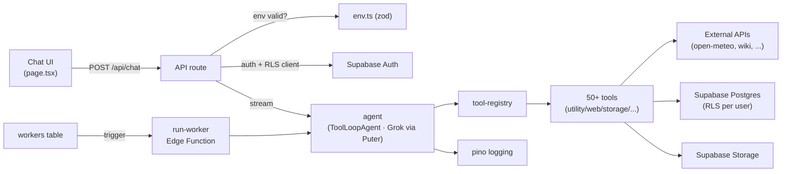

# BRUTHA

A minimal **AI agent** built with **Next.js 16 (App Router)**, the **Vercel AI SDK v6**, and **xAI's Grok served through Puter.js**. It demonstrates the core loop of an agent framework: the model reasons, calls tools, reads the results, and loops until it has a final answer — all streamed to a chat UI. Grok inference runs over Puter's OpenAI-compatible endpoint, so no xAI API key is needed for chat.

## Features

- **Agentic tool-calling loop** via the AI SDK's `ToolLoopAgent` (model → tool → model, up to 14 steps).
- **Streaming responses** with the `useChat` hook (AI SDK v6).
- **50+ built-in tools**, organized by category in `src/lib/tools/`:

  **Math & conversions** — `calculate`, `convertUnits` (length/mass/temp/volume), `convertCurrency` (live ECB rates), `convertTimeZone`, `numberToWords`

  **Dates** — `dateDiff`, `daysUntil`, `addToDate`, `dayOfWeek`, `createCalendarEvent` (.ics export)

  **Time & weather** — `getCurrentTime`, `getWeather`, `forecast` (multi-day), `sunriseSunset`

  **Knowledge & web** — `wikipedia`, `dictionary`, `fetchUrl` (read any page/API), `countryInfo`, `cryptoPrice`, `ipInfo`, `topNews` (Hacker News), `translate`

  **Geo** — `distanceBetween` (great-circle distance), `sunriseSunset`

  **Memory (Supabase Postgres)** — contacts: `saveContact` / `findContact` / `listContacts` / `updateContact` / `deleteContact`; notes: `saveNote` / `searchNotes` (Postgres full-text) / `listNotes` / `deleteNote`; tasks: `addTask` / `listTasks` / `completeTask` / `deleteTask`

  **Text & data** — `slugify`, `changeCase` (upper/lower/title/camel/snake/kebab), `regexExtract`, `formatJson`, `csvToJson`, `parseUrl`, `sortList`

  **Generators & encoders** — `generatePassword`, `generateUuid`, `hashText` (md5/sha1/sha256/sha512), `encodeBase64`, `qrCode`, `randomNumber`, `rollDice`, `colorInfo`, `countText`

  **Health & fun** — `calculateBmi`, `getJoke`, `getQuote`, `activitySuggestion`

  **Email (optional)** — `sendEmail` via SMTP; defaults to the configured test recipient and reports "not configured" if no creds

- **Visible tool activity** — the UI shows when the agent invokes a tool.
- **Supabase-backed** — auth (Supabase Auth), per-user data (Postgres with Row
  Level Security), file uploads (private Storage bucket), and background workers
  (Edge Function) all run on Supabase. The app is stateless and deploys anywhere.
- Almost every tool is **keyless** and works out of the box (only `sendEmail` needs config).
- TypeScript + Tailwind CSS throughout.

## Project structure

```
src/
├── lib/
│   ├── agent.ts          # Agent definition: model, system prompt, composes all tools
│   ├── auth.ts           # Supabase server-side auth helpers (getCurrentUser)
│   ├── scope.ts          # Per-request RLS-scoped Supabase client (AsyncLocalStorage)
│   ├── settings.ts       # Per-user key/value settings (Supabase)
│   ├── request-scope.ts  # Resolve signed-in user + bind RLS-scoped client
│   ├── email.ts          # SMTP email sending (nodemailer)
│   ├── supabase/         # Supabase clients: client.ts / server.ts / admin.ts + types
│   └── tools/
│       ├── utility.ts    # calculate, conversions, generators, encoders
│       ├── web.ts        # weather, wikipedia, currency, crypto, news, ...
│       ├── storage.ts    # contacts / notes / tasks CRUD (Postgres + RLS)
│       ├── datetime.ts   # date diff/add, day-of-week, ICS event export
│       ├── text.ts       # translate, slugify, case, regex, JSON/CSV, URL, sort
│       ├── extras.ts     # jokes, quotes, sunrise/sunset, distance, BMI, activity
│       ├── workers.ts    # createWorker / listWorkers / getWorkerResult
│       └── email.ts      # sendEmail tool
├── proxy.ts              # Supabase session refresh + route protection (Next 16 proxy)
└── app/
    ├── api/chat/route.ts # Streaming chat endpoint (Node.js runtime)
    ├── auth/callback/    # OAuth / email-confirmation callback
    ├── page.tsx          # Chat UI (useChat)
    └── layout.tsx
supabase/
├── migrations/           # Postgres schema, RLS, FTS, Storage bucket, worker trigger
└── functions/run-worker/ # Edge Function that executes background workers
```

## Getting started

### 1. Install dependencies

```bash
npm install
```

### 2. Configure your keys

Get your Puter auth token from [puter.com/dashboard#account](https://puter.com/dashboard#account)
(it powers Grok inference) and create a Supabase project (https://supabase.com),
then:

```bash
cp .env.example .env.local
```

Edit `.env.local` and set at least:

```
PUTER_AUTH_TOKEN=your-puter-token
NEXT_PUBLIC_SUPABASE_URL=https://<ref>.supabase.co
NEXT_PUBLIC_SUPABASE_ANON_KEY=your-anon-key
SUPABASE_SERVICE_ROLE_KEY=your-service-role-key
```

> No xAI API key is needed for chat — Grok runs through Puter. `XAI_API_KEY` is
> only required if you enable the optional image-generation tool.

Apply the database schema (creates tables, RLS, Storage bucket, worker trigger):

```bash
supabase link --project-ref <your-project-ref>
supabase db push
```

`.env.local` is gitignored — your keys are never committed. See
[DEPLOYMENT.md](./DEPLOYMENT.md) for the full Supabase + Vercel setup.

### 3. Run the dev server

```bash
npm run dev
```

Open [http://localhost:3000](http://localhost:3000).

Try:
- *"What is (128 \* 12) + 47?"* → uses the `calculate` tool
- *"What time is it in Tokyo right now?"* → uses the `getCurrentTime` tool

## How it works

`src/lib/agent.ts` defines a `ToolLoopAgent` with the Grok model (served via
Puter.js — see `src/lib/puter.ts`), a system prompt, and a set of tools. Each
tool has a Zod `inputSchema` (so the model knows how to call it) and an
`execute` function that runs on the server.

The API route (`src/app/api/chat/route.ts`) converts incoming UI messages to
model messages, builds the agent with `buildAgent(...)`, runs `agent.stream(...)`,
and returns `toUIMessageStreamResponse()` — which streams text *and* tool events
to the client.

## Background workers (Supabase Edge Functions)

BRUTHA can run agent tasks **in the background** — ask it to do something "in the
background" and it spawns a **Worker**. Workers are fully serverless:

1. Creating a worker inserts a row into the `workers` table (status `queued`).
2. A Postgres trigger calls the **`run-worker` Edge Function** over HTTP.
3. The Edge Function runs the agent loop (Grok + memory tools) and writes the
   result back to the row, updating a live progress line as it goes.
4. The Workers panel subscribes via **Supabase Realtime** (`postgres_changes`),
   so status/progress/results stream in live — no polling.

This replaces the old Temporal worker process and runs with zero long-lived
infrastructure, so it deploys on Vercel.

```
supabase/functions/run-worker/   # Deno Edge Function (agent executor)
supabase/migrations/             # workers table + RLS + dispatch trigger
src/lib/workers.ts               # create/list/get workers (Supabase)
src/app/WorkersPanel.tsx         # Realtime-subscribed UI panel
```

Deploy it with `supabase functions deploy run-worker` and set the function's
secrets (`PUTER_AUTH_TOKEN`, optional `XAI_MODEL`). See
[DEPLOYMENT.md](./DEPLOYMENT.md) for the full setup including the dispatch trigger.

## Agent tuning

BRUTHA's behavior is tunable via environment variables (no model weight
training — xAI does not expose Grok fine-tuning). `src/lib/agent.ts` exposes a
typed `AgentConfig` resolved from env:

| Env var             | Default  | Description                                  |
| ------------------- | -------- | -------------------------------------------- |
| `XAI_MODEL`         | `x-ai/grok-4-1-fast` | Grok model id served by Puter.        |
| `AGENT_TEMPERATURE` | `0.2`    | Sampling temperature; lower = steadier tools.|
| `AGENT_MAX_STEPS`   | `14`     | Max model↔tool steps before the loop stops.  |

The system prompt also carries explicit **tool-routing guidance** (pick the
most specific tool, prefer tools over stale memory for live data, reuse prior
results, ask one clarifying question instead of guessing missing args).

## Architecture



## Running tests

Unit and integration tests use [Vitest](https://vitest.dev):

```bash
npm test            # run once
npm run test:watch  # watch mode
npm run test:coverage
```

Tests live next to the code (`src/**/*.test.ts`) and under `tests/`, and all run
through a single Vitest invocation (`npm test`). They cover the tool error
helpers, the LRU cache's single-flight behavior, env validation, the tool
registry/manifest, i18n, the web tools' fetch timeout/error hardening, password
hashing, per-user scope (AsyncLocalStorage), upload validation, and the
`/api/chat` route's validation branches (no live model call required).

## Tool discovery

Every registered tool is listed at `/admin/tools` (a hidden, noindex page) and
as JSON at `/api/tools`. Add tools via the registry's `registerTool` hook or by
extending a category module under `src/lib/tools/`.

## Docker

```bash
docker compose up --build      # builds the image and runs on :3000
```

Set `XAI_API_KEY` and your Supabase env vars in your shell or a local `.env`
file first. The container is stateless — all data lives in Supabase, so no
volume is needed.

## Internationalization

UI strings live in `locales/*.json`. The active locale is resolved from the
browser language (or `APP_LOCALE` on the server) via `src/lib/i18n.ts`. English
and Spanish ship by default; add a catalog and extend `SUPPORTED_LOCALES` to add
more.

## Adding your own tools

Add an entry to the `tools` object in `src/lib/agent.ts`:

```ts
myTool: tool({
  description: "What it does and when to use it.",
  inputSchema: z.object({ query: z.string() }),
  execute: async ({ query }) => {
    // ...do work, return JSON-serializable result
    return { ok: true };
  },
}),
```

The model will automatically discover and call it when relevant.

## Configuration

| Env var                         | Default              | Description                          |
| ------------------------------- | -------------------- | ------------------------------------ |
| `PUTER_AUTH_TOKEN`              | _(none)_             | Required. Puter token; powers Grok.  |
| `NEXT_PUBLIC_SUPABASE_URL`      | _(none)_             | Required. Supabase project URL.      |
| `NEXT_PUBLIC_SUPABASE_ANON_KEY` | _(none)_             | Required. Supabase anon/public key.  |
| `SUPABASE_SERVICE_ROLE_KEY`     | _(none)_             | Server-only. Admin/Edge Function.    |
| `XAI_MODEL`                     | `x-ai/grok-4-1-fast` | Optional. Grok model id (via Puter). |
| `XAI_API_KEY`                   | _(none)_             | Optional. Only for image generation. |
| `SMTP_HOST`    | _(none)_     | Optional. SMTP server for `sendEmail`. |
| `SMTP_PORT`    | _(none)_     | Optional. 465 (SSL) or 587 (STARTTLS). |
| `SMTP_USER`    | _(none)_     | Optional. SMTP username / email.     |
| `SMTP_PASS`    | _(none)_     | Optional. SMTP / app password.       |
| `SMTP_FROM`    | `SMTP_USER`  | Optional. From address.              |
| `TEST_EMAIL_TO`| `you@example.com` | Default recipient when `sendEmail` is called without a `to`. |

> **Email is optional.** Without SMTP vars, the `sendEmail` tool simply
> reports that email is not configured — the rest of the agent works fine.
> For Gmail, use an [app password](https://myaccount.google.com/apppasswords),
> not your account password.

## Tech stack

- [Next.js 16](https://nextjs.org)
- [AI SDK v6](https://sdk.vercel.ai) + [`@ai-sdk/openai-compatible`](https://www.npmjs.com/package/@ai-sdk/openai-compatible) → xAI Grok via [Puter.js](https://developer.puter.com/ai/x-ai/)
- [Supabase](https://supabase.com) — Postgres, Auth, Storage, Realtime, Edge Functions
- [Zod](https://zod.dev) for tool schemas
- [Tailwind CSS](https://tailwindcss.com)

## License

MIT
